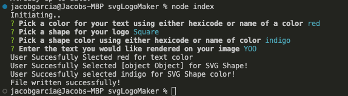

# SVG_Logo_Generator

## Description
This app is designed to create a simple SVG logo using input from the command line interface
    
## Table of Contents
None
    
## Installation
To use this application, user must install node.js, as well as inquirer version -- 8.00
    
## Credits/Contributors
None

## license
MIT 

Link: https://opensource.org/licenses/MIT

## Features
Create an SVG logo with preset circle, square, or triangle presets. User can define the shape from these given options as well as text and shape color. Once CLI prompts are completed, an SVG logo will be generated and saved to the same directory as index.js file. Drag the file into a browser to render the results!
    
## ScreenShots
Succsesfull SVG render: 

CLI input used to generate SVG:

    
## How to contribute
Please reach out to suggest contributions